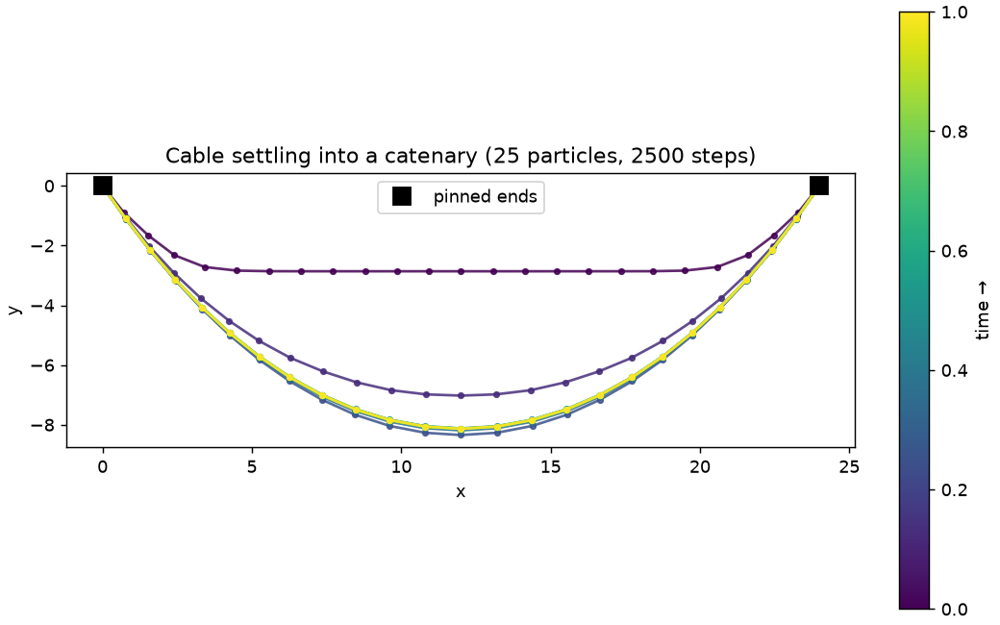
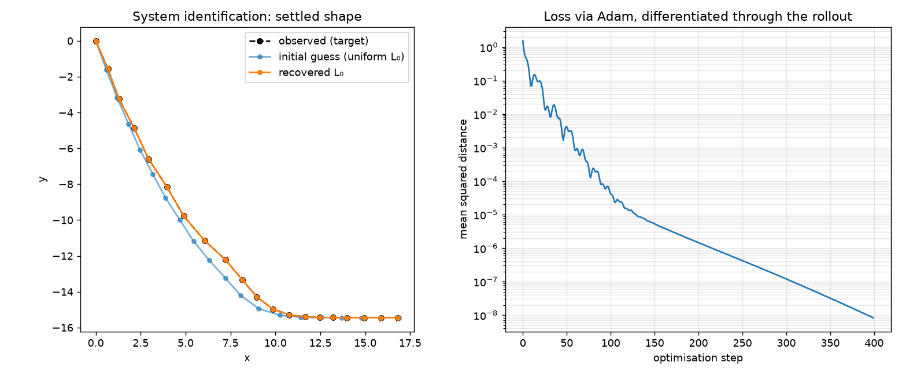
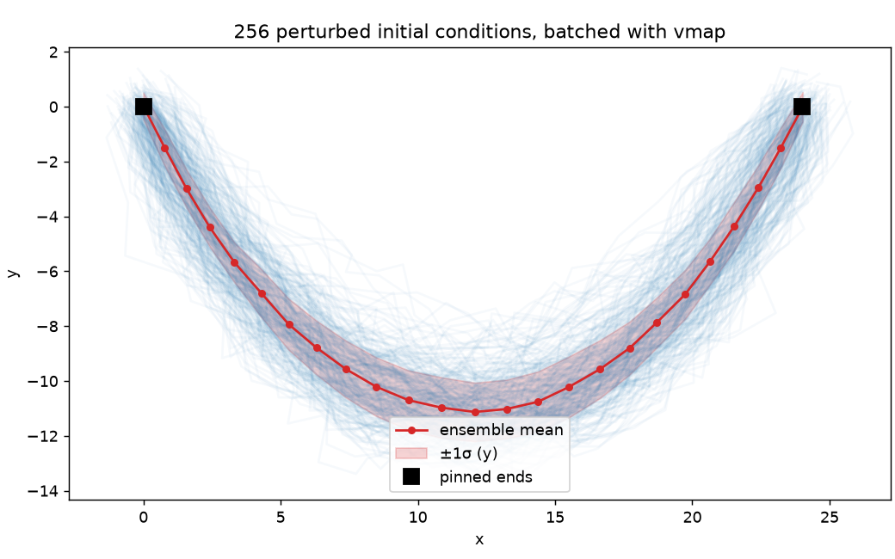

# jax-spring-sim

[](https://github.com/erik2810/jax-spring-sim/actions/workflows/ci.yml)
[](pyproject.toml)
[](https://docs.jax.dev)
[](LICENSE)

A differentiable, JIT-compiled **particle-spring physics simulator** built on
JAX. It is a compact, self-contained demonstrator for the four program
transformations that define modern Scientific Machine Learning (SciML):
`jax.jit`, `jax.grad` / `jax.value_and_grad`, and `jax.vmap`, all over
`jax.numpy`.

The physics is deliberately classical — Hookean springs, gravity, a symplectic
integrator — so that the focus stays on *how* the computation is expressed. The
defining choices are:

- **Forces are never hand-derived.** A single scalar potential energy
  $U(\mathbf{x})$ is written down, and the force field is obtained by automatic
  differentiation, $\mathbf{F} = -\nabla_{\mathbf{x}} U$.
- **The time loop is a compiled scan, not a Python loop.** The whole rollout is
  a `jax.lax.scan` under `jax.jit`, so XLA fuses it into one kernel and it is
  efficiently reverse-mode differentiable end to end.
- **Inverse problems are gradient descent through the simulator.** Because every
  step is differentiable, recovering hidden parameters from an observed shape is
  just `value_and_grad` plus Adam.

> Note on stack: the rest of this author's work defaults to PyTorch. JAX is used
> here on purpose — the functional, transform-based model (`jit` / `grad` /
> `vmap` as composable function-to-function maps) is exactly the SciML idiom
> this project sets out to demonstrate.

---

## The four transforms, mapped to the code

| Transform              | Where                                   | What it does                                              |
| ---------------------- | --------------------------------------- | -------------------------------------------------------- |
| `jax.numpy`            | [`energy.py`](src/jax_spring_sim/energy.py), [`builders.py`](src/jax_spring_sim/builders.py) | Array/mesh manipulation of positions, edges, rest lengths |
| `jax.grad`             | [`energy.py`](src/jax_spring_sim/energy.py)   | Forces as the gradient of the energy, $\mathbf{F}=-\nabla U$ |
| `jax.jit` + `lax.scan` | [`dynamics.py`](src/jax_spring_sim/dynamics.py) | Fuse the entire rollout into one compiled XLA kernel       |
| `jax.vmap`             | [`batch.py`](src/jax_spring_sim/batch.py)     | Vectorise an ensemble over initial conditions             |
| `jax.value_and_grad`   | [`inverse.py`](src/jax_spring_sim/inverse.py) | Differentiate *through* the rollout for inverse design     |

---

## Mathematical background

### Energy

The system state is particle positions $\mathbf{x} \in \mathbb{R}^{N\times D}$
and velocities $\mathbf{v}$. The potential energy is the sum of a Hookean spring
term over edges $e=(i,j)$ and a gravitational term:

$$
U(\mathbf{x}) =
\underbrace{\tfrac12 \sum_{e=(i,j)} k_e \big(\lVert \mathbf{x}_i - \mathbf{x}_j \rVert - L_e\big)^2}_{\text{springs}}
\;-\;
\underbrace{\sum_i m_i\, \mathbf{g}\cdot\mathbf{x}_i}_{\text{gravity}} .
$$

### Forces by autodiff

In a hand-written engine you would differentiate the spring term analytically,
obtain $\mathbf{F}_e = -k_e(\lVert\mathbf{r}\rVert - L_e)\,\hat{\mathbf{r}}$, and
re-derive it for every new energy term. Here the force is one line:

```python
force = -jax.grad(total_energy)(pos, system)
```

`jax.grad` returns the *exact* gradient (to machine precision, not a
finite-difference approximation), so adding a new potential — a bending energy,
a collision penalty, an external field — is a one-line change with correct
forces for free. The test suite pins this down with
`jax.test_util.check_grads` (the JAX analogue of `torch.autograd.gradcheck`).

### Integration

Time stepping uses **semi-implicit (symplectic) Euler**, which updates velocity
before position:

$$
\mathbf{v}_{t+1} = \big(\mathbf{v}_t + \Delta t\, \mathbf{a}_t\big)\,\gamma,
\qquad
\mathbf{x}_{t+1} = \mathbf{x}_t + \Delta t\, \mathbf{v}_{t+1},
$$

with damping $\gamma \in (0,1]$ and accelerations
$\mathbf{a}_t = \mathbf{F}(\mathbf{x}_t)/m$. Symplectic Euler keeps the total
energy bounded over long undamped rollouts (verified in the tests), unlike
explicit Euler, which injects energy and blows up.

### Collision (optional, O(N) via a spatial hash grid)

Springs act along an edge list, so the force loop is already O(E), which is O(N)
for a mesh. Non-bonded contact is different: any two particles that come within a
cutoff $r_c$ repel, and testing every pair is O(N^2). The optional collision term
adds a short-range penalty over close pairs,

$$
U_\text{col} = \tfrac12 k_\text{col} \sum_{i<j,\; r_{ij} < r_c} (r_c - r_{ij})^2 ,
$$

and evaluates it in linear time with a spatial hash grid (`spatial.py`): each
particle is hashed into a cell of side $r_c$ and only compared against the $3^D$
cells around it. The hashing and sorting that pick which pairs interact are
integer operations and carry no gradient, which is what you want. The energy is
still a smooth function of the positions of the selected pairs, so `jax.grad`
produces the collision force exactly as it produces every other force, and it
matches the naive all-pairs gradient to machine precision
(`tests/test_spatial.py`).

Collision is off by default, so existing rollouts are unchanged. Turn it on per
rollout:

```python
state, system = make_cloth(20, 20, collision_stiffness=50.0, collision_radius=0.9)
final, traj = simulate(state, system, dt=1e-3, n_steps=500, collide=True)
```

`benchmarks/collision_scaling.py` compares the two directly. The naive all-pairs
gradient scales like $N^2$ and runs out of memory past about $10^4$ particles,
while the hashed grid stays close to linear and keeps going. On a laptop CPU it is
about 6x faster at 8k particles and still runs at 32k where the all-pairs version
cannot allocate its distance matrix.

### Learned equivariant surrogate (`egnn.py`)

Everything above integrates the known physics. `egnn.py` learns a neural surrogate
that predicts one step directly, and the point is the symmetry. The true spring
dynamics is equivariant: rotate and translate the mesh and every next position and
velocity moves the same way. A plain network that ate raw coordinates would break
that; this surrogate is E(n)-equivariant by construction (Satorras et al. 2021), so
it obeys the same SE(3) symmetry as the physics it imitates, to machine precision.

It is written in the same from-scratch style as the rest of the engine (parameter
pytrees and `jax.numpy`, no neural-network framework), so it composes with `jit` /
`grad` / `vmap` and trains with the package's own `adam`. Messages run over the
spring edge list and depend on coordinates only through the invariant squared
distance $\lVert x_i - x_j \rVert^2$; the surrogate predicts the next velocity as an
equivariant combination of the relative vectors $x_i - x_j$, and the position
follows the integrator's own rule $x_\text{next} = x + \Delta t\, v_\text{next}$.

```python
import jax
from jax_spring_sim import egnn, make_cloth
from jax_spring_sim.dynamics import step

state, system = make_cloth(4, 4, gravity=(0.0, 0.0, 0.0))  # gravity-free => equivariant
params = egnn.init_params(jax.random.PRNGKey(0), node_feat_dim=2, edge_attr_dim=2)
pred = egnn.predict_step(params, state, system, dt=5e-3)    # a learned stand-in for step()
```

`tests/test_egnn.py` verifies the SE(3) equivariance to 1e-5, checks the gradient
against finite differences, and trains the surrogate against the true integrator:
the one-step loss drops about 15x and the trained model beats the do-nothing
baseline on both position and velocity.

---

## Quick start

This project uses [`uv`](https://docs.astral.sh/uv/).

```bash
uv sync                 # core (jax, jaxlib)
uv sync --extra viz     # + matplotlib/numpy for the example figures
uv sync --extra dev     # + pytest, ruff, mypy
```

Or run it in a container without installing anything (CPU JAX; prints the
benchmark sweep and exits). A prebuilt image is published to GHCR:

```bash
docker run --rm ghcr.io/erik2810/jax-spring-sim
```

Or build it locally:

```bash
docker build -t jax-spring-sim . && docker run --rm jax-spring-sim
```

A minimal forward simulation:

```python
import jax
from jax_spring_sim import make_chain, simulate, simulate_final

state, system = make_chain(20)            # pinned chain under gravity
final, trajectory = simulate(state, system, dt=0.01, n_steps=500)
print(final.pos.shape)                      # (20, 2)
```

One forward-backward step through the whole rollout, gradients w.r.t. every
rest length at once:

```python
import jax
from jax_spring_sim import make_chain, trajectory_loss

state, system = make_chain(20)
target = state.pos                            # any observed shape, (20, 2)
loss = lambda rest: trajectory_loss(rest, state, system, target, 0.01, 250)
value, grads = jax.value_and_grad(loss)(system.rest_length)
print(value, grads.shape)                     # scalar loss, (19,)
```

Inverse design — recover hidden rest lengths from an observed shape:

```python
from jax_spring_sim import fit_rest_lengths, make_chain

state, system = make_chain(20)
# `target` is an observed settled shape, (20, 2). See examples/inverse_design.py
# for how it is generated from hidden rest lengths.
rest_length, losses = fit_rest_lengths(state, system, target, 0.01, 250, opt_steps=400)
# losses[-1] / losses[0] ~ 1e-8 : the differentiable rollout fits the target exactly
```

Batched ensemble over initial conditions:

```python
import jax
from jax_spring_sim import make_chain, perturb_initial, simulate_ensemble

state, system = make_chain(20)
states0 = perturb_initial(state, jax.random.PRNGKey(0), batch=256, scale=0.1)
finals = simulate_ensemble(states0, system, 0.01, 500)   # one batched kernel
print(finals.pos.shape)                                   # (256, 20, 2)
```

---

## Performance: why JAX over a standard iterative loop

The headline question is the one in the task: what does JAX buy over a standard
iterative physics loop? The benchmark ([`benchmarks/benchmark.py`](benchmarks/benchmark.py))
runs the *same* hanging-chain rollout ($N=60$ particles, $2000$ steps) four
ways. Numbers below are from a single Apple-Silicon **CPU**, JAX 0.10.2,
float32 — your mileage varies, the *ratios* are the point.

A wider sweep lives in [`benchmarks/profile_engine.py`](benchmarks/profile_engine.py): system sizes
up to 50k nodes, jit vs. eager per step, and gradient cost vs. rollout horizon,
written to [`BENCHMARKS.md`](BENCHMARKS.md) with the environment it was
measured on.

```
implementation                      time / rollout     speedup vs JAX-jit
------------------------------------------------------------------------
naive Python loop                        196.2 ms           0.5x  (2x slower)
NumPy vectorised                          56.3 ms           1.8x  (faster)
JAX jit (first call, w/ compile)         113.6 ms           0.9x
JAX jit (steady state)                    99.6 ms           1.0x

ensemble of 512 trajectories             total       per-trajectory
------------------------------------------------------------------------
JAX serial (Python loop of jit)        64072 ms        125.1 ms
JAX vmap (single batched kernel)         817 ms          1.60 ms   <-- 78x
```

Read this honestly, because the honest reading is the strong one:

**1. Against the textbook iterative loop, JAX wins outright.** The naive
double-`for`-loop simulator — the thing "standard iterative physics loop"
literally describes — runs at 196 ms. The jit-compiled `lax.scan` does the
identical work in 100 ms, **~2× faster**, single-threaded, with no manual
vectorisation. The Python interpreter never touches the per-step inner loop.

**2. On a single small rollout, NumPy is competitive — and that is expected.**
For $N=60$ the per-step kernels are tiny, so XLA's strengths (operator fusion,
no dispatch overhead) have little to bite on, and NumPy's mature BLAS edges
ahead. JAX is *not* magic that makes every loop faster; pretending otherwise
would be the wrong lesson. JAX wins decisively in three regimes that matter for
SciML:

**3. Batching is the decisive win — `vmap`.** Running 512 trajectories as a
Python loop of jitted calls costs 125 ms each; a single `vmap`'d kernel costs
**1.6 ms each — a 78× speedup**, and ~35× faster *per trajectory* than NumPy and
~120× faster than the naive loop. Ensembles, parameter sweeps, and Monte-Carlo
uncertainty propagation are exactly where simulation time is actually spent, and
this is one line of code:

```python
jax.vmap(simulate_final, in_axes=(0, None, None, None))
```

**4. Exact gradients at $O(1)$ cost — `value_and_grad`.** The inverse-design
example fits 19 rest lengths so the simulated shape matches an observation,
driving the loss from $1.5$ to $8\times10^{-9}$ (a $10^{8}$ reduction). Reverse-
mode autodiff computes $\nabla_\theta\mathcal{L}$ for *all* parameters at the
cost of roughly one extra rollout, **independent of the number of parameters**.
A finite-difference gradient would need one rollout per parameter ($O(P)$) and
be far less accurate — gradient-based inverse design simply is not practical
without it. This capability has no analogue in a classical iterative loop at
all.

**5. Write once, run on accelerators.** The same code targets GPU/TPU with no
changes. On accelerators the per-step kernels and the batch dimension parallelise
massively — precisely the regime where CPU NumPy cannot follow.

A cross-check in the benchmark confirms the JAX and NumPy rollouts agree to
$\sim\!2\times10^{-3}$ over 2000 steps (the residual is float32 vs float64
accumulation, not a logic difference).

### Summary

| Capability                              | Naive Python loop | NumPy loop | JAX (this repo) |
| --------------------------------------- | :---------------: | :--------: | :-------------: |
| Vectorised over particles/edges         |         ✗         |     ✓      |        ✓        |
| Compiled time loop (no Python per step) |         ✗         |     ✗      |        ✓        |
| Batched ensembles in one kernel         |         ✗         |     ✗      |   ✓ (`vmap`)    |
| Exact gradients, $O(1)$ in #params      |         ✗         |     ✗      |   ✓ (`grad`)    |
| GPU / TPU with no code change           |         ✗         |     ✗      |        ✓        |

---

## Examples

Generated by the scripts in [`examples/`](examples/) (`uv run --extra viz python examples/<name>.py`):

**`hanging_chain.py`** — a cable pinned at both ends settling into a catenary;
trajectory snapshots coloured by time (forward rollout under `jit`).



**`inverse_design.py`** — system identification: recover hidden, non-uniform
rest lengths from an observed settled shape by differentiating through the
rollout. The loss converges over ~9 orders of magnitude and the recovered
parameters match the ground truth to $\sim\!10^{-3}$.



**`ensemble.py`** — 256 perturbed initial conditions advanced as a single
`vmap` batch, drawn as an uncertainty band around the mean shape.




---

## Interactive viewer (WebGPU)

**Live demo:** https://erik2810.github.io/jax-spring-sim/ (a static, pre-baked build)

An optional browser viewer renders the simulations live: the JAX backend
computes a trajectory and streams it frame-by-frame over a WebSocket (binary
protocol — JSON only for control messages), and a three.js **WebGPU** frontend
draws the particles (instanced, coloured by speed via a TSL node material) and
springs, with playback, scene switching, and parameter controls.

This is the Python-compute / JS-view split: numerics stay in JAX, rendering and
interaction in three.js, joined by a little-endian Float32 frame protocol
(`server/protocol.py` ↔ `frontend/src/lib/protocol.js`).

```bash
# 1. backend — FastAPI + uvicorn, streams JAX trajectories on :8000
uv sync --extra server
uv run python -m jax_spring_sim.server

# 2. frontend — Vite + React + three.js (WebGPU/TSL) on :5173
cd frontend && npm install && npm run dev
```

Three scenes: a **catenary** (both ends pinned), a 3D **cloth drape**, and
**inverse design** — `value_and_grad` recovering hidden rest lengths, with the
chain visibly morphing onto the target shape as Adam runs. See
[`frontend/README.md`](frontend/README.md) for details.

### Static deployment (GitHub Pages)

For a backend-free demo, trajectories are pre-computed to binary bundles and the
frontend loads those instead of the WebSocket:

```bash
uv run python scripts/bake_scenes.py frontend/public/scenes   # bake with JAX
cd frontend && VITE_STATIC=true BASE_PATH=/jax-spring-sim/ npm run build
```

The [`deploy-pages`](.github/workflows/deploy-pages.yml) workflow does exactly
this on every push to `main` and publishes `frontend/dist` to GitHub Pages. In
static mode the parameter sliders are replaced by a note (recomputing needs the
backend); scene switching and playback still work.

---

## Project layout

```
jax-spring-sim/
├── pyproject.toml              uv-managed; ruff + pytest + mypy config
├── src/
│   └── jax_spring_sim/
│       ├── system.py           State / SpringSystem pytrees (NamedTuple)
│       ├── energy.py           potential energy; forces via jax.grad
│       ├── spatial.py          differentiable spatial hash grid; O(N) collision
│       ├── egnn.py             learned SE(3)-equivariant one-step surrogate
│       ├── dynamics.py         symplectic Euler; jit + lax.scan rollout
│       ├── builders.py         make_chain / make_cloth constructors
│       ├── batch.py            jax.vmap ensemble simulation
│       ├── inverse.py          value_and_grad inverse design + Adam
│       └── server/             FastAPI WebSocket backend for the viewer
│           ├── protocol.py     binary frame protocol (struct + numpy)
│           ├── scenes.py       JAX trajectories -> streamable frames
│           └── app.py          FastAPI app + /ws endpoint
├── frontend/                   Vite + React + three.js (WebGPU/TSL) viewer
│   └── src/{viewer,lib,components}
├── scripts/bake_scenes.py      pre-bake scenes for the static Pages build
├── tests/
│   ├── test_energy.py          energy/force correctness
│   ├── test_dynamics.py        pinning, shapes, symplectic energy bound
│   ├── test_grad.py            check_grads (finite-difference gradient check)
│   ├── test_batch.py           vmap vs serial-loop equivalence
│   ├── test_inverse.py         inverse-design convergence
│   ├── test_spatial.py         hash grid vs naive parity + collision gradcheck
│   ├── test_egnn.py            surrogate SE(3) equivariance + learns one step
│   └── test_server.py          binary protocol + WebSocket streaming
├── examples/                   runnable figures
├── benchmarks/                 benchmark.py, profile_engine.py, collision_scaling.py
├── Dockerfile                  slim CPU image; runs the quick benchmark sweep
├── CITATION.cff
├── CHANGELOG.md
└── .github/workflows/
    ├── ci.yml                  ruff + mypy + pytest on 3.10–3.12
    └── deploy-pages.yml        bake scenes + deploy static viewer to Pages
```

---

## Development

```bash
uv run ruff check .          # lint (E, F, W, I, UP, B, SIM)
uv run ruff format .         # format (line length 100)
uv run mypy                  # type-check src/
uv run pytest                # 16 tests, incl. gradient checks + WebSocket stream
```

Gradient correctness is treated as a first-class invariant: any new
differentiable operation should come with a `check_grads` test, since a silently
broken gradient (e.g. a non-differentiable op slipping into the rollout) is the
most common and most costly bug in differentiable-physics code.

---

## Citation

See [`CITATION.cff`](CITATION.cff). This work builds directly on JAX
(Bradbury et al., 2018).

## License

MIT — see [`LICENSE`](LICENSE).
